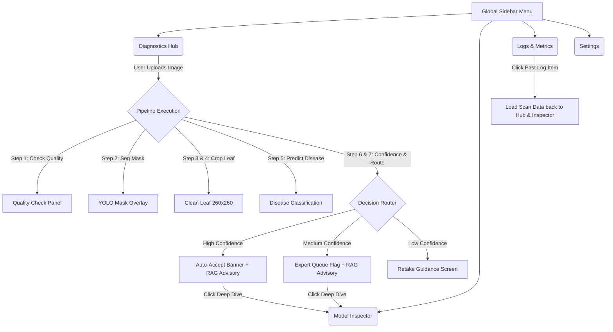

# 🎨 Design Specification: CPL Crop Doctor Frontend

This document outlines the user interface (UI) architecture, component hierarchy, states, design tokens, and layout guidelines for the **CPL Crop Doctor Frontend**. It is structured for hand-off to UI/UX designers and frontend developers.

---

## 🟢 1. Design System & Design Tokens

To deliver a premium, high-impact aesthetic, use an **Organic Dark Theme** featuring **Glassmorphism** to emphasize high-tech AI capabilities. The colors and typography must feel clean, modern, and professional.

### 🎨 Color Palette (Tailored HSL)

| Token Name | HSL Value | Hex (Approx) | Purpose / Usage |
| :--- | :--- | :--- | :--- |
| **`bg-darkest`** | `hsl(140, 20%, 6%)` | `#0b0f0c` | Global background |
| **`bg-card`** | `hsl(140, 15%, 12%)` | `#1a221d` | Card panels, sidebars |
| **`border-glass`** | `hsla(140, 30%, 30%, 0.15)`| `rgba(53,100,69,0.15)`| Translucent border highlights |
| **`accent-green`** | `hsl(145, 80%, 45%)` | `#17b864` | Primary actions, high confidence status |
| **`accent-mint`** | `hsl(158, 65%, 75%)` | `#96ebd0` | Text highlights, secondary active links |
| **`status-warning`**| `hsl(38, 95%, 55%)` | `#faa31e` | Medium confidence, expert queue flags |
| **`status-danger`** | `hsl(0, 85%, 60%)` | `#f24444` | Low confidence, retake errors |
| **`text-bright`** | `hsl(0, 0%, 96%)` | `#f5f5f5` | Headings, readability text |
| **`text-muted`** | `hsl(140, 10%, 65%)` | `#9ea9a2` | Subheadings, caption states, logs |

### ✍️ Typography & Scale
*   **Primary Font**: `Outfit` (Google Fonts) — Used for headings, banners, and status badges.
*   **Secondary Font**: `Inter` (Google Fonts) — Used for body copy, telemetry lists, tables, and logs.
*   **Font Weights**: Regular (`400`), Medium (`500`), Semi-Bold (`600`), Bold (`700`).
*   **Typography Scale**:
    *   `h1` (Display): `2.25rem` (`36px`), Bold, letter-spacing `-0.02em`
    *   `h2` (Section headers): `1.5rem` (`24px`), Semi-Bold
    *   `h3` (Card titles): `1.15rem` (`18px`), Medium
    *   `body`: `0.95rem` (`15px`), Regular, line-height `1.6`
    *   `caption`: `0.8rem` (`12px`), Regular, letter-spacing `0.05em`

### ✨ UI Effects & Micro-Animations
*   **Glassmorphism Glass-Backing**:
    ```css
    background: rgba(26, 34, 29, 0.45);
    backdrop-filter: blur(16px);
    border: 1px solid hsla(140, 30%, 30%, 0.15);
    border-radius: 16px;
    box-shadow: 0 8px 32px 0 rgba(0, 0, 0, 0.37);
    ```
*   **Transitions**: Use `cubic-bezier(0.4, 0, 0.2, 1)` with `300ms` duration for all tab switches, hover states, and expanders.
*   **Glow Effects**: Hovering interactive elements should emit a soft, diffused radial shadow of the accent color (e.g., `box-shadow: 0 0 20px rgba(23, 184, 100, 0.2)`).

---

## 🗂 2. Global Screen Layout Structure

The app is built as a responsive Single Page Application (SPA).

```
+---------------------------------------------------------------------------------+
|                               GLOBAL TOP BAR                                    |
| [🌿 CPL CROP DOCTOR]                             [🟢 API Online] [⚙️ settings]   |
+---------------------+-----------------------------------------------------------+
|                     |                                                           |
|  SIDE NAVIGATION    |                   MAIN ACTIVE VIEW PORT                   |
|                     |                                                           |
| 📱 Diagnostics Hub  |                                                           |
| 🔍 Model Inspector  |                   (Loads active screen)                   |
| 📊 Logs & Metrics   |                                                           |
|                     |                                                           |
+---------------------+-----------------------------------------------------------+
```

### Navigation Links
1.  **Diagnostics Hub** (`/diagnostics`) - Primary diagnostic interface for farmers and field workers.
2.  **Model Inspector** (`/inspector`) - Explanations, confidence fusion weights, and Grad-CAM visualizations.
3.  **Logs & Metrics** (`/analytics`) - Spatial simulation map, historical activity log, and overall pipeline performance.

---

## 🖥 3. Screen 1: Diagnostics Hub

This is the primary scanner. It guides the user from uploading a leaf photo to reading the final diagnosis and RAG-generated advisory.

### Screen 1 Components Structure

```
+---------------------------------------------------------------------------------+
|                                DIAGNOSTICS HUB                                  |
+------------------------------------+--------------------------------------------+
|                                    |                                            |
|   1. PHOTO UPLOADER BOX            |   4. DIAGNOSIS ACTION BANNER               |
|   - Drag & Drop zone               |      [🟢 AUTO-ACCEPT: 92% CONFIDENT]       |
|   - Upload / Camera buttons        |                                            |
|   - Image Preview pane             |   5. RAG ADVISORY SECTION (Tabbed Card)    |
|                                    |      [Symptoms] [Organic] [Chemical] [Prev]|
|   2. TELEMETRY PIPELINE STEPPER    |      +----------------------------------+  |
|      - Step 1: Quality Check   [v] |      | Selected Tab Advisory Content    |  |
|      - Step 2: YOLO Seg. Mask  [v] |      +----------------------------------+  |
|      - Step 3: Area Validation [v] |                                            |
|      - Step 4: Crop Extraction [v] |   6. CHROMADB REFERENCES (Accordion)       |
|                                    |      [+] View Sources (3 chunks found)     |
|   3. IMAGES SIDE-BY-SIDE           |                                            |
|      [ Original ] [ Masked / Clean]|                                            |
|                                    |                                            |
+------------------------------------+--------------------------------------------+
```

### 🧱 Component Breakdown (Screen 1)

#### 1. Photo Uploader Box
*   **Visual Design**: A large rectangular area with a dotted border (`accent-green` color), a central upload icon, and descriptive text.
*   **Interactions**:
    *   *Default state*: "Drag and drop leaf photo, or click to upload."
    *   *Hover state*: Dotted border glows; background darkens.
    *   *Uploading state*: Progress spinner overlays the box.
    *   *Uploaded state*: Displays the user's photo with a clean "Remove & Retake" hover-button.

#### 2. Telemetry Pipeline Stepper
*   **Visual Design**: A vertical checklist representing the pipeline layers. Each step features a status badge and dropdown toggle.
*   **Steps List**:
    *   **Image Quality**: Shows resolution, contrast, blur, and brightness. Displays warning chips if any threshold is violated.
    *   **YOLO Segmentation**: Displays detection count and mask confidence.
    *   **Leaf Area**: Details percentage of the frame covered.
    *   **Background Removal**: Shows 260x260 cropped output preview.
    *   **AI Disease Classification**: Confirms the classifier execution.

#### 3. Images Comparison Drawer
*   **Visual Design**: Renders the original upload side-by-side with the YOLO mask overlay (semi-transparent red mask painted on top of the leaf).

#### 4. Diagnosis Action Banner
*   **Visual Design**: Full-width glowing card that dynamically colors itself based on the pipeline decision:
    *   **High Confidence** (`Auto-Accept`): Emerald Green glow. Big bold diagnosis text (e.g., `Tomato::Late Blight`) and confidence meter.
    *   **Medium Confidence** (`Expert Queue`): Amber Yellow glow. Display warning: `⚠️ Forwarding to Expert Review Queue`.
    *   **Low Confidence / Failure** (`Retake`): Deep Crimson glow. Print warning: `❌ Photo Rejected — Retake Required`. Shows a bulleted list of helpful suggestions (e.g. "Hold closer," "Improve light").

#### 5. RAG Advisory Tabs Card
*   **Visual Design**: Tabbed interface containing detailed agricultural advisories retrieved from text manuals:
    *   *Tab A (Symptoms)*: Bullet points describing visual identifiers of the disease.
    *   *Tab B (Organic Treatment)*: Natural cures, herbal spray compositions, or pruning advice.
    *   *Tab C (Chemical Intervention)*: Specific fungicide/pesticide ingredients.
    *   *Tab D (Prevention)*: Crop rotation periods, spacing guidelines, and watering tips.

#### 6. ChromaDB References Accordion
*   **Visual Design**: Styled accordion. Clicking it expands to reveal cards containing actual document paragraphs retrieved from the vector database, complete with cosine similarity scores.

---

## 🖥 4. Screen 2: Deep-Dive Model Inspector

For developers, agronomists, and judges to examine the decision parameters and trust metrics behind the model's prediction.

### Screen 2 Components Structure

```
+---------------------------------------------------------------------------------+
|                                 MODEL INSPECTOR                                 |
+------------------------------------+--------------------------------------------+
|                                    |                                            |
|   1. GRAD-CAM SALIENCY VISUALIZER  |   3. MULTI-MODEL CROP VALIDATOR            |
|      - Saliency Heatmap Overlay    |      - Comparison table of 3 inputs:       |
|      - Blending Opacity Slider     |        a) EfficientNetB2 (Marginal)        |
|      - [Saliency] / [SmoothGrad]   |        b) Hierarchical Router (Trained)    |
|                                    |        c) OpenAI CLIP (Zero-shot)          |
|   2. CONFIDENCE SIGNAL FUSION      |                                            |
|      - List of input signals       |   4. LATENCY PIE / TIMELINE CHART          |
|      - Contribution weights table  |      - OpenCV, YOLO, Classifier, RAG, etc. |
|      - Radial gauges (SVG)         |      - Total response time telemetry       |
|                                    |                                            |
+------------------------------------+--------------------------------------------+
```

### 🧱 Component Breakdown (Screen 2)

#### 1. Grad-CAM Saliency Visualizer
*   **Visual Design**: Interactive image display showcasing the cropped leaf.
*   **Interactive Opacity Slider**: A slide-bar (`0%` to `100%`) that blends the red/yellow Grad-CAM heatmap directly over the cropped leaf. This lets users identify the exact spots on the leaf the model examined.
*   **Toggle Switch**: Switch between "Saliency" (raw gradient map) and "SmoothGrad" (averaged, noise-reduced gradient map).

#### 2. Confidence Signal Fusion Panel
*   **Visual Design**: Radial gauge indicators (SVG) showing the quality score, YOLO confidence, classifier top-1, prediction gap, crop router, and CLIP agreement scores.
*   **Formula Readout**: Displays a breakdown of how the final score was computed:
    $$\text{Final Confidence} = \sum (\text{Signal Value} \times \text{Weight})$$

#### 3. Multi-Model Crop Validator
*   **Visual Design**: Grid/Table listing the crop classification from 3 independent neural pipelines:
    1.  **Joint Classifier**: Crop output parsed from the 139-class softmax.
    2.  **Trained Hierarchical Router**: Deduced crop from the dedicated router head.
    3.  **OpenAI CLIP (Zero-Shot)**: Similarity metrics matching prompt tokens (e.g., *"a photo of a cotton leaf"*).
*   **Status Indicator**: Bold badge indicating `✓ AGREEMENT` (all agree) or `⚠️ DISAGREEMENT` (potential failure).

#### 4. Latency Telemetry Timeline
*   **Visual Design**: Horizontal timing bars representing milliseconds spent at each stage (OpenCV quality inspection, YOLO leaf segmentation, crop extraction, TensorFlow classification, SmoothGrad explanation, and Gemini RAG query).

---

## 🖥 5. Screen 3: Logs & Metrics

Designed for administrative and overview purposes, keeping track of history and simulating regional occurrences.

### Screen 3 Components Structure

```
+---------------------------------------------------------------------------------+
|                                 LOGS & METRICS                                  |
+------------------------------------+--------------------------------------------+
|                                    |                                            |
|   1. KPI SUMMARY CARDS             |   3. SPATIAL INFECTION MAP                 |
|      [Scans] [Avg Conf] [Review %] |      - Interactive map showing infection   |
|                                    |        hotspots.                           |
|   2. HISTORICAL ACTIVITY FEED      |      - Filterable by crop or disease.      |
|      - Search bar                  |                                            |
|      - List: Date, Crop,           |   4. ANALYTICS CHARTS                      |
|        Diagnosis, Status           |      - Bar chart: Top infections by crop   |
|      - [Load into Scanner] button  |      - Scatter plot: Confidence over time  |
|                                    |                                            |
+------------------------------------+--------------------------------------------+
```

### 🧱 Component Breakdown (Screen 3)

#### 1. KPI Cards Row
*   **Visual Design**: A flex-row of 3 or 4 glowing glass panels.
    *   *Total Scans*: Number of uploads processed.
    *   *Average Confidence*: Mean confidence score.
    *   *Expert Queue Rate*: Percentage of scans routed to expert review.

#### 2. Historical Activity Feed
*   **Visual Design**: A high-density grid showing history items:
    *   *Columns*: Timestamp, Crop Name, Diagnosed Disease, Final Confidence (with colored badge), and Router Decision (Accepted, Review, Rejected).
    *   *Interactions*: Clicking on a row opens a preview modal or loads the entire historical scan state directly back into the **Diagnostics Hub** and **Model Inspector** screens.

#### 3. Spatial Infection Map
*   **Visual Design**: Vector style map container displaying mock pins of agricultural disease hotspots. Pins are color-coded (Green = Healthy, Yellow = Mild Disease, Red = Severe Disease outbreak).
*   **Hover State**: Hovering over a pin displays a tool-tip with the coordinates, crop type, and crop owner details.

#### 4. Analytics Panel
*   **Visual Design**: Rendered charts displaying system metrics (e.g. crop distribution of diseases, success/failure rate of scans over time).

---

## 🛠 6. Screen 4: App Configuration (Settings Modal or Sidebar tab)

This panel allows users to adjust backend thresholds and configure model options.

*   **API Base URL Input**: Direct connection endpoints.
*   **Confidence Weights Tuner**: Interactive sliders to modify confidence signals weights (image quality weight, YOLO mask weight, prediction gap weight, etc.).
*   **Router Decision Boundaries**: Sliders to set the boundaries between `Auto-Accept`, `Expert Review`, and `Retake` (e.g. threshold boundaries at `0.80` and `0.50`).

---

## 🧭 7. Screen Navigation Flow Diagram



---

## 🎨 8. Guidelines for Designers & Assets Generation

*   **Icon Set**: Use organic, modern outline icons (such as Lucide, Tabler, or Google Material Symbols). Main categories: Leaves, Shield Alert, History, Map Pin, Activity, Info/Help, Sliders, Upload Cloud.
*   **Badges**: Status badges should feature rounded pills with semi-transparent background colors:
    *   `hsla(145, 80%, 45%, 0.15)` for Accept
    *   `hsla(38, 95%, 55%, 0.15)` for Review
    *   `hsla(0, 85%, 60%, 0.15)` for Reject/Retake
*   **Responsiveness**: Columns must stack vertically on mobile viewports (`< 768px`). The sidebar should collapse into a floating hamburger menu, shifting the diagnostics hub layout into a single, clean vertical feed.
*   **Visual Assets Needed**:
    1.  *Background Vector Grid*: Subtle glowing geometric mesh or grid lines in the background.
    2.  *Fallback Crop Image*: Premium organic illustrations of crops (Tomato, Cotton, Rice) to display when no image is uploaded.
